# Step-by-Step WordPress Deployment on AWS EC2 instance.

## Introduction

This project is a step-by-step guide to setting up and running a WordPress website on a server. It uses Apache as the web server and MariaDB as the database. The guide covers everything from preparing the server, installing the needed software, setting up WordPress, and finally making the website live on the internet. By following it, you can create a secure, reliable, and ready-to-use WordPress site.

## Requirements

Before deploying the WordPress website, ensure the following are installed and configured:

Linux Server – Amazon Linux.

Web Server – Apache installed and running.

PHP – Along with required PHP extensions.

Database – MariaDB for storing WordPress data.

## Steps for Deployment

### Step 1: Launch EC2 instance and Establishing a secure connection to your EC2 instance

1. Launch instance 

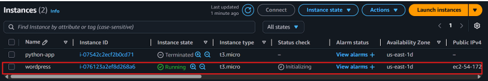

2. Copy the SSH command

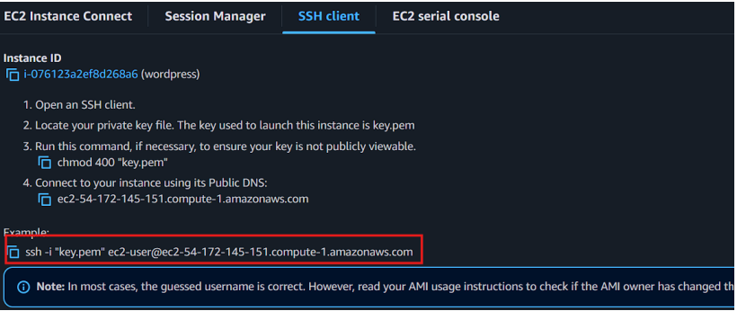

3. Paste command in Git bash 

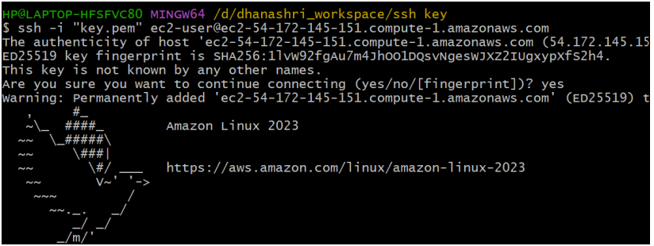

### Step 2: Automating LAMP Stack Setup on AWS EC2

1. Create a LAMP.sh file

    sudo vim LAMP.sh

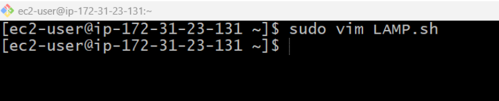

2. Insert the code for installing apache, mysql and php

    sudo yum update

    sudo yum install httpd mariadb105-server php -y

    sudo systemctl start httpd mariadb php-fpm

    sudo systemctl enable httpd mariadb php-fpm

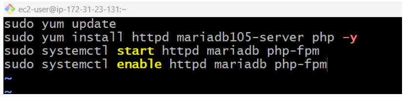

3. Run the file 

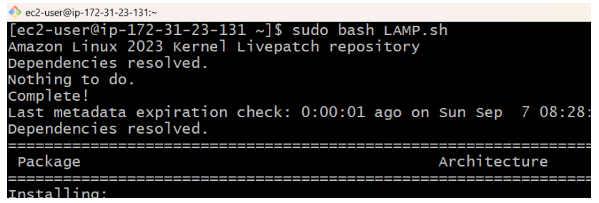

### Step 3: Download and Configure WordPress

#Download WordPress

sudo wget https://wordpress.org/latest.tar.gz

#Extract the archive

sudo tar -xvzf latest.tar.gz

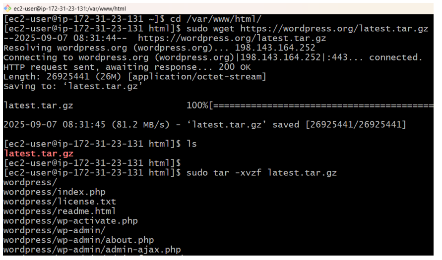

### Step 4: Remove latest.tar.gz

sudo rm -rf latest.tar.gz

ls

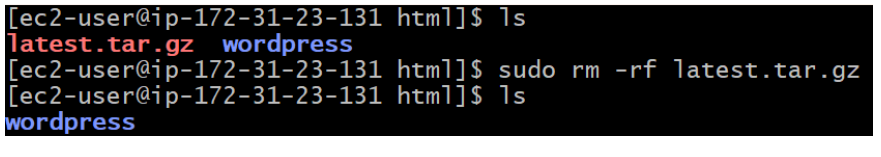
### Step 5: Go to the wordpress folder

cd wordpress/

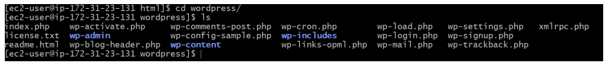

### Step 6: Create WordPress Database

1. Generate the username and password.

     sudo mysql

     alter user root@localhost identified by 'root';

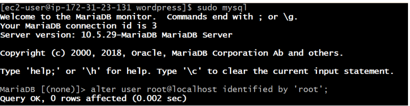

2. Login to Mysql (mariadb105-server)

     sudo mysql -u root -p

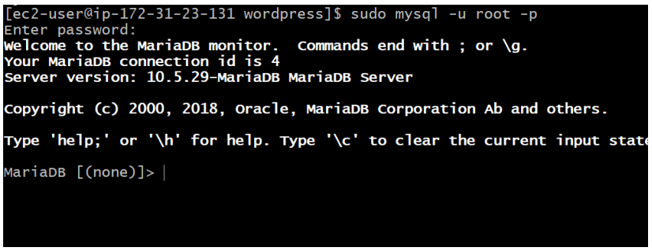

3. Create Database

     #Create Database

     create database wordpressdb;

     #Show Database

     show databases;

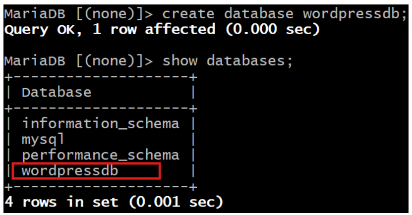

### Step 7: Install Connector

sudo yum install php8.4-mysqlnd.x86_64

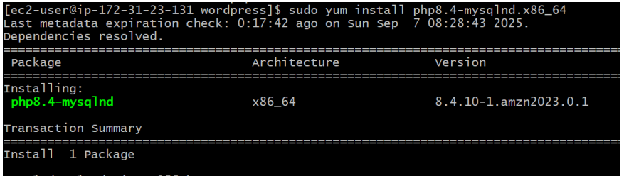

### Step 8: Change ownership of the files

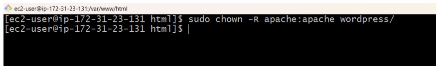

### Step 9: Paste the Public IP and Paste it in any browser.

1. Click on Continue 

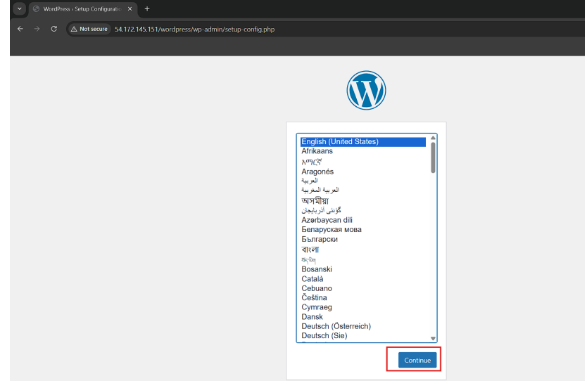

2. Click on Let,s go 

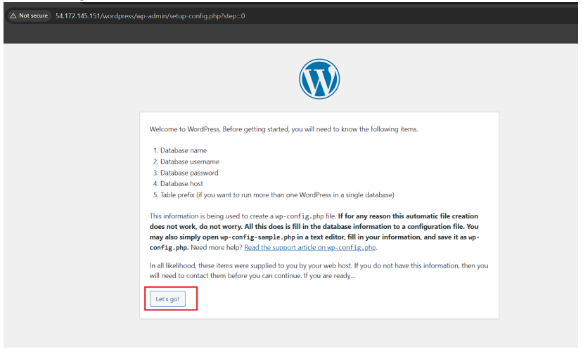

3. Fill the information and click on Submit 

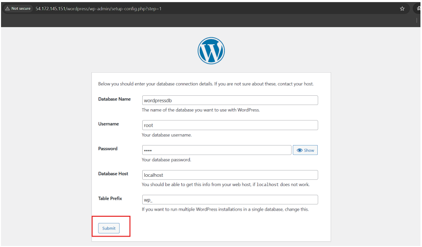

4. Run the Installation 

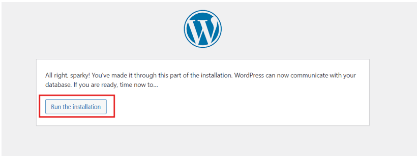

5. Fill the information and click on Install Wordpress 

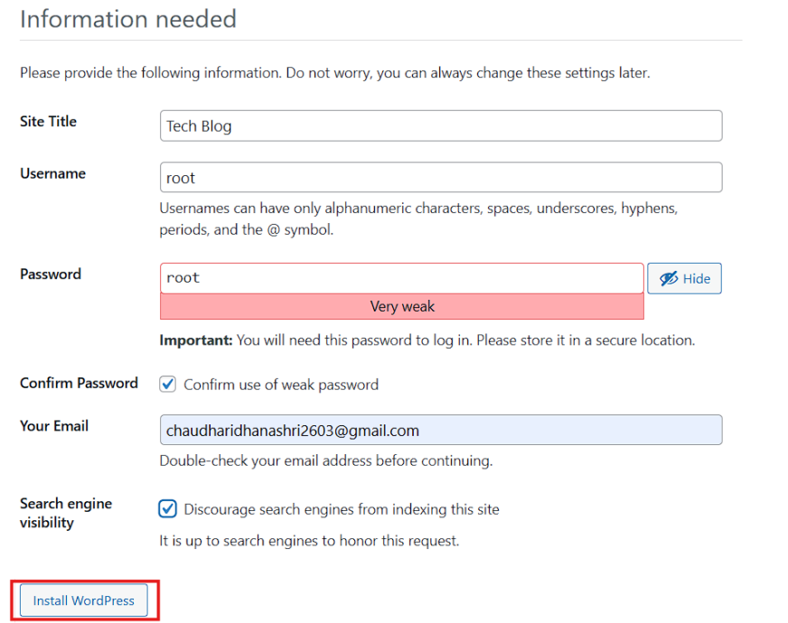

6. Login to Wordpress 

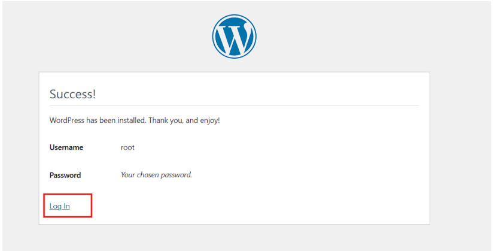

7. Deployed Wordpress successfully

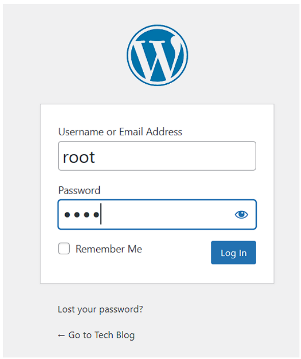

8. Table automatically added to Database

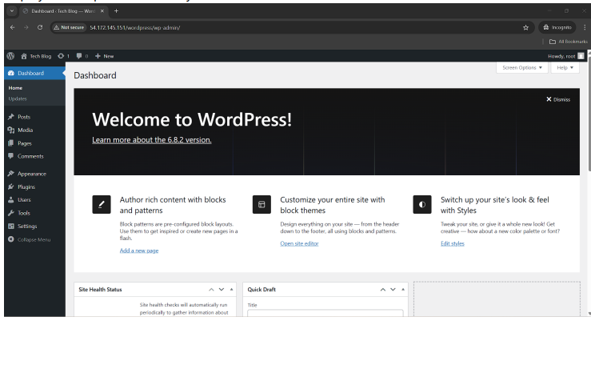

# Summary

This project is a complete guide to setting up a WordPress website on a Linux server. It uses Apache as the web server and MariaDB as the database. The guide explains how to download and install WordPress, set the right file permissions, create and connect the database, and configure the web server for live use. By following it, you’ll get a secure, reliable, and fully working WordPress site that’s ready for people to visit.

